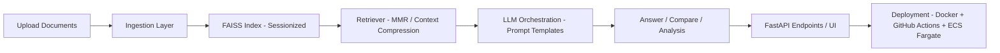
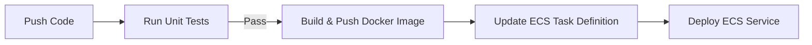

# 📄 DocuFlow – Modular RAG MVP

**DocuFlow** is a small but complete **Retrieval-Augmented Generation (RAG)** application.
It demonstrates how to build a **clean, modular, and deployable** RAG pipeline — not just another “chat with your PDFs” demo.

---

## 🚀 Features

* **Document Q\&A** – upload PDFs/DOCs/TXT, ask questions.
* **Document Analysis** – extract metadata (title, authors, sentiment, etc.).
* **Document Comparison** – page-by-page differences between two docs.
* **Multi-document Support** – index multiple files and chat across them.
* **Configurable LLMs** – OpenAI, Groq, or Google Gemini via `config.yaml`.
* **Deployment Ready** – Dockerized, CI/CD pipeline, AWS ECS Fargate deploy.

---

## 🧩 Architecture



---

## 📂 Project Structure

```
├── api/                  # FastAPI entrypoints
│   └── main.py
├── src/
│   ├── document_ingestion/  # File saving, chunking, FAISS manager
│   ├── document_chat/       # Conversational RAG chains
│   ├── document_compare/    # Page-by-page comparison
│   ├── document_analyzer/   # Metadata extraction
│   └── multi_document_chat/ # Multi-file retrievers
├── prompt/               # Prompt templates
├── utils/                # Config loader, file I/O, helpers
├── config/               # config.yaml (embeddings/LLMs)
├── logger/               # Structlog-based JSON logging
├── .github/workflows/    # CI/CD pipelines (tests + deploy)
├── Dockerfile
├── requirements.txt
└── README.md
```

---

## 🔧 Tech Stack

* **Backend**: FastAPI
* **Vector Store**: FAISS
* **LLMs**: OpenAI GPT, Groq, Google Gemini (configurable)
* **Infra**: Docker, GitHub Actions, AWS ECS Fargate
* **Logging**: Structlog + CloudWatch

---

## ⚡ Usage

### 1. Run Locally

```bash
git clone https://github.com/<your-username>/docuflow.git
cd docuflow

# Create venv
python -m venv .venv
source .venv/bin/activate

# Install deps
pip install -r requirements.txt

# Set env vars (example)
export OPENAI_API_KEY=your_key
export LLM_PROVIDER=openai
export FAISS_BASE=faiss_index
export UPLOADED_BASE=data

# Run app
uvicorn api.main:app --reload --host 0.0.0.0 --port 8080
```

### 2. Endpoints

* **Health check** → `GET /health`
* **Analyze document** → `POST /analyze`
* **Compare two docs** → `POST /compare`
* **Index documents** → `POST /chat/index`
* **Query documents** → `POST /chat/query`

### 3. Example (curl)

```bash
# Build index
curl -X POST "http://localhost:8080/chat/index" \
  -F "files=@./sample.pdf"

# Query
curl -X POST "http://localhost:8080/chat/query" \
  -F "question=What are the key points?" \
  -F "session_id=<returned-session-id>"
```

---

## 📦 Deployment

### CI/CD Workflow

1. **Push to main**
2. GitHub Actions runs unit tests (`ci.yml`).
3. On success, build Docker image and push to ECR (`aws.yml`).
4. Deploy updated task definition to AWS ECS Fargate.


